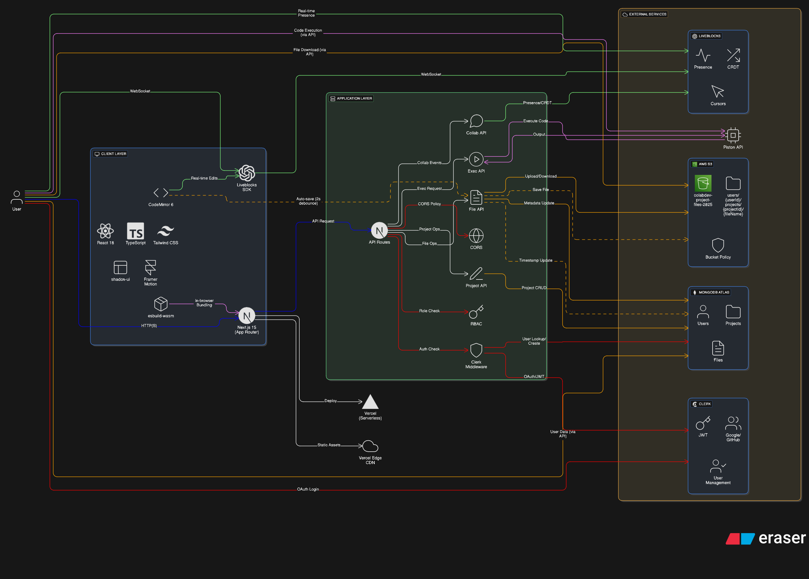

# ColabDev - Real-Time Collaborative Code Editor

<div align="center">


**A Major Capstone Project - BMS College of Engineering**

*A modern, cloud-based collaborative coding platform built for developers, by developers*

[](https://nextjs.org/)
[](https://reactjs.org/)
[](https://www.typescriptlang.org/)
[](https://www.mongodb.com/)
[](https://liveblocks.io/)
[](https://aws.amazon.com/)

[Live Demo](https://colab-dev-rose.vercel.app/) · [Report Bug](https://github.com/aniketh1/ColabDev/issues) · [Request Feature](https://github.com/aniketh1/ColabDev/issues)

</div>

---

## 📸 Screenshots

### 🏠 Home Page


*Modern landing page with authentication and real-time statistics*

### 📊 Dashboard


*Intuitive project management dashboard*

### 💻 Code Editor


*Powerful collaborative code editor with live preview*

---

## 📋 Table of Contents

- [About The Project](#about-the-project)
- [Key Features](#key-features)
- [Architecture](#architecture)
- [Tech Stack](#tech-stack)
- [Getting Started](#getting-started)
- [Environment Variables](#environment-variables)
- [Project Structure](#project-structure)
- [Team](#team)
- [Contributing](#contributing)
- [License](#license)

---

## 🎯 About The Project

**ColabDev** is a cutting-edge, real-time collaborative code editor designed to revolutionize how developers work together. This major capstone project, developed by students at **BMS College of Engineering**, provides a seamless coding experience that eliminates geographical barriers and makes remote collaboration as natural as working side-by-side.

As a comprehensive full-stack application, ColabDev demonstrates modern software engineering practices, cloud architecture, and real-time collaboration technologies. This project showcases our team's ability to integrate complex systems including authentication, cloud storage, real-time synchronization, and in-browser code execution into a cohesive, production-ready platform.

### Project Context

- **Institution**: BMS College of Engineering, Bangalore
- **Department**: Computer Science & Engineering
- **Project Type**: Major Capstone Project
- **Academic Year**: 2024-2025
- **Duration**: 6 months (Development + Testing + Deployment)

### Problem Statement

Traditional code collaboration tools often require complex setup, lack real-time synchronization, or are limited by paid tiers. Our project aims to provide a free, open-source alternative that combines the best features of existing platforms while maintaining simplicity and accessibility.

### Solution

ColabDev offers a cloud-based collaborative coding environment with:

- Real-time multi-user editing with conflict-free synchronization
- Support for multiple programming languages and frameworks
- In-browser code execution without server setup
- Secure authentication and project management
- Free and open-source architecture

---

## ✨ Key Features

### Real-Time Collaboration

- **Live Cursors**: See where your teammates are working in real-time
- **Instant Updates**: Changes sync across all connected users instantly
- **Presence Awareness**: Know who's online and actively editing
- **Conflict-Free Editing**: Advanced CRDT algorithms prevent merge conflicts

### Multi-Language Support

- **React Projects**: Full support for JSX, hooks, and modern React patterns
- **Node.js**: Backend development with npm package management
- **HTML/CSS/JS**: Classic web development with instant preview
- **Next.js**: Full-stack framework support

### Advanced Code Execution

- **In-Browser Bundling**: esbuild-powered fast compilation
- **Live Preview**: See your changes instantly in the preview pane
- **Console Output**: Full console logging and error reporting
- **Piston API Integration**: Secure code execution in isolated environments

### Project Management

- **Multiple Projects**: Create and manage unlimited projects
- **Cloud Storage**: All files stored securely in AWS S3
- **Project Sharing**: Generate shareable links for read-only access
- **Version History**: Track changes and revert when needed

### Security & Authentication

- **Secure Authentication**: Powered by Clerk for enterprise-grade security
- **Role-Based Access**: Granular control over project permissions
- **Auto-Save**: Never lose your work with automatic cloud synchronization
- **Dark Mode**: Easy on the eyes during those late-night coding sessions

---

## 🏗️ Architecture



The application follows a modern microservices architecture with:

- **Frontend**: Next.js 15 with React 18 and TypeScript
- **Backend**: Next.js API routes with serverless functions
- **Database**: MongoDB Atlas for scalable data persistence
- **Real-Time**: Liveblocks for collaborative editing
- **Storage**: AWS S3 for file storage
- **Authentication**: Clerk for secure user management
- **Deployment**: Vercel for global CDN and serverless hosting

---

## 🛠️ Tech Stack

### Frontend
- **Framework**: Next.js 15
- **UI Library**: React 18
- **Styling**: Tailwind CSS + Shadcn UI
- **Language**: TypeScript 5
- **State Management**: React Hooks + Context API

### Backend
- **Runtime**: Node.js
- **Database**: MongoDB with Mongoose
- **Authentication**: Clerk
- **Real-Time**: Liveblocks + WebSockets
- **File Storage**: AWS S3

### Development Tools
- **Code Editor**: CodeMirror 6
- **Bundling**: esbuild (in-browser)
- **Code Execution**: Piston API
- **Deployment**: Vercel
- **Version Control**: Git

### Key Dependencies
- `@liveblocks/react` - Real-time collaboration
- `@clerk/nextjs` - Authentication
- `@aws-sdk/client-s3` - Cloud storage
- `@codemirror/*` - Code editing
- `@webcontainer/api` - In-browser execution
- `yjs` - CRDT for conflict-free editing

---

## 🚀 Getting Started

### Prerequisites

- Node.js 18+
- npm or yarn
- MongoDB Atlas account
- AWS account (for S3)
- Clerk account
- Liveblocks account

### Installation

1. **Clone the repository**
   ```bash
   git clone https://github.com/aniketh1/ColabDev.git
   cd ColabDev
   ```

2. **Install dependencies**
   ```bash
   npm install
   ```

3. **Set up environment variables**
   ```bash
   cp .env.example .env.local
   ```
   Fill in the required environment variables (see [Environment Variables](#environment-variables))

4. **Run the development server**
   ```bash
   npm run dev
   ```

5. **Open your browser**
   Navigate to [http://localhost:3000](http://localhost:3000)

### Build for Production

```bash
npm run build
npm start
```

---

## 🔧 Environment Variables

Create a `.env.local` file in the root directory with the following variables:

```env
# Database
MONGODB_URI=mongodb+srv://...

# Authentication (Clerk)
NEXT_PUBLIC_CLERK_PUBLISHABLE_KEY=pk_test_...
CLERK_SECRET_KEY=sk_test_...

# Real-Time Collaboration (Liveblocks)
NEXT_PUBLIC_LIVEBLOCKS_PUBLIC_KEY=pk_...
LIVEBLOCKS_SECRET_KEY=sk_...

# AWS S3
AWS_ACCESS_KEY_ID=...
AWS_SECRET_ACCESS_KEY=...
AWS_REGION=...
AWS_S3_BUCKET_NAME=...

# Email (Resend)
RESEND_API_KEY=re_...

# Other
NEXT_PUBLIC_APP_URL=http://localhost:3000
```

---

## 📁 Project Structure

```
colabdev/
├── public/                 # Static assets
│   ├── demo/              # Demo screenshots
│   └── logos/             # Brand assets
├── src/
│   ├── app/               # Next.js app router
│   │   ├── api/           # API routes
│   │   ├── dashboard/     # Dashboard pages
│   │   └── editor/        # Code editor pages
│   ├── components/        # Reusable UI components
│   │   ├── ui/            # Shadcn UI components
│   │   ├── editor/        # Code editor components
│   │   └── dashboard/     # Dashboard components
│   ├── contexts/          # React contexts
│   ├── hooks/             # Custom React hooks
│   ├── lib/               # Utility libraries
│   ├── models/            # Database models
│   ├── utils/             # Helper functions
│   └── types/             # TypeScript type definitions
├── .env.local             # Environment variables
├── package.json           # Dependencies and scripts
├── tailwind.config.ts     # Tailwind CSS configuration
└── tsconfig.json          # TypeScript configuration
```

---

## 👥 Team

**ColabDev** was developed by a dedicated team of Computer Science students at BMS College of Engineering:

- **Aniket V Korwar** - Full Stack Developer & Project Lead (USN: 1BM23IS403)
- **Rohan Raju Navalyal** - Data Analyst & System Architect (USN: 1BM22IS162)
- **Suprit Sanadi** - Cloud Engineer (USN: 1BM23IS416)

*For more information about the team, visit our [About page](/about)*

---

## 🤝 Contributing

We welcome contributions from the community! Here's how you can help:

1. **Fork the repository**
2. **Create a feature branch** (`git checkout -b feature/amazing-feature`)
3. **Commit your changes** (`git commit -m 'Add some amazing feature'`)
4. **Push to the branch** (`git push origin feature/amazing-feature`)
5. **Open a Pull Request**

### Development Guidelines

- Follow the existing code style and conventions
- Write clear, concise commit messages
- Add tests for new features
- Update documentation as needed
- Ensure all tests pass before submitting

---

## 📄 License

This project is licensed under the MIT License - see the [LICENSE](LICENSE) file for details.

---

## 🙏 Acknowledgments

- **BMS College of Engineering** for providing the platform and guidance
- **Liveblocks** for real-time collaboration infrastructure
- **Clerk** for seamless authentication
- **AWS** for cloud storage solutions
- **Vercel** for hosting and deployment
- **Open Source Community** for the amazing tools and libraries

---

## 📞 Contact

- **Project Repository**: [https://github.com/aniketh1/ColabDev](https://github.com/aniketh1/ColabDev)
- **Live Demo**: [https://colab-dev-rose.vercel.app/](https://colab-dev-rose.vercel.app/)
- **Issues**: [https://github.com/aniketh1/ColabDev/issues](https://github.com/aniketh1/ColabDev/issues)

---

<div align="center">

**Made with ❤️ by BMS College of Engineering Students**

[](https://www.linkedin.com/in/aniket-korwar-064550203)
[](https://aniketkorwar.netlify.app)

</div>